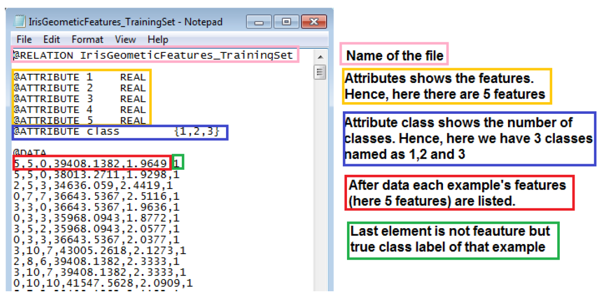

# Age Prediction Based On Iris Data

In this project, age prediction based on iris biometric data using deep learning and Tensorflow library with different numbers of hidden layer is implemented.
The main purpose of the age prediction systems is to determine age group (group1: <25, group2: 25-60 and group3: >60 ) of the person in a query image. The prediction is done by evaluating semantic contents of the query image. However, there is a diffculty in revealing the semantics of images due to the semantic gap. In order to overcome this diffculty, images are described as feature vectors which are higher level representations than collection of numbers.
With these feature vectors, age prediction can be formulated as a learning problem to match an image representation with the age group of person in the image.

• Texture features: These are features which describe the pattern of the iris available only from the overall finished output of the acquisition, segmentation, normalisation and feature extraction process respectively.
• Geometric features: These are features which describe the shape (physical appearance) of the iris, and are thus available only from the output of the acquisition and segmentation process respectively.
• Both geometric and texture features: simply is the combination (concatanation) of both feature types.
First two types of features are given to you in a seperate text files. You need to read features from these files and also form the third type feature set. File description is as follows;

    

## TRAINING WITH GEOMETRIC FEATURES

### Results with 4 different Hidden Layer NN

|            | Layer-0 | Layer-1 | Layer-2 | Layer-3 |
| ---------- | ------- | ------- | ------- | ------- |
| Validation | 47.6    | 57.6    | 57.7    | 57.7    |

## TRANING WITH TEXTURE FEATURES

### Results with 4 different Hidden Layer NN

|            | Layer-0 | Layer-1 | Layer-2 | Layer-3 |
| ---------- | ------- | ------- | ------- | ------- |
| Validation | 70.9    | 72.7    | 68      | 65      |

## TRAINING WITH GEOMETRIC AND TEXTURE FEATURES

### Results with 4 different Hidden Layer NN

|            | Layer-0 | Layer-1 | Layer-2 | Layer-3 |
| ---------- | ------- | ------- | ------- | ------- |
| Validation | 52.3    | 57.6    | 57.8    | 58      |
